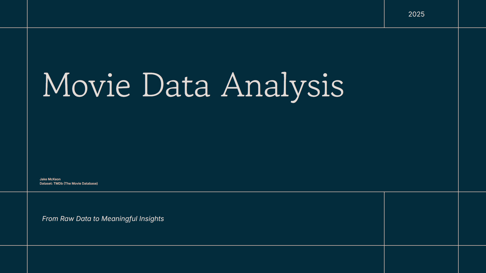
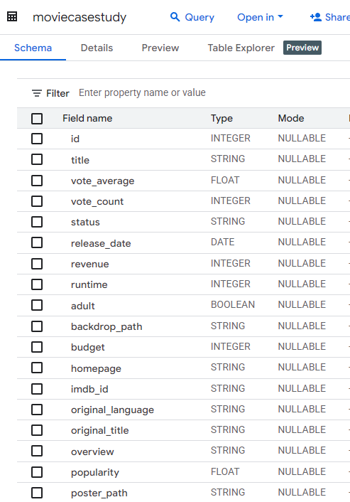
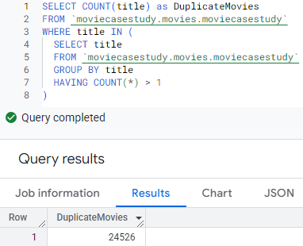
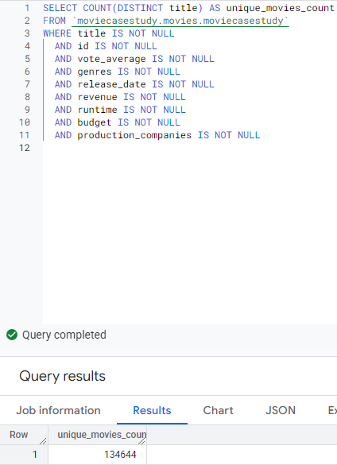
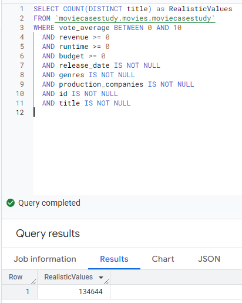
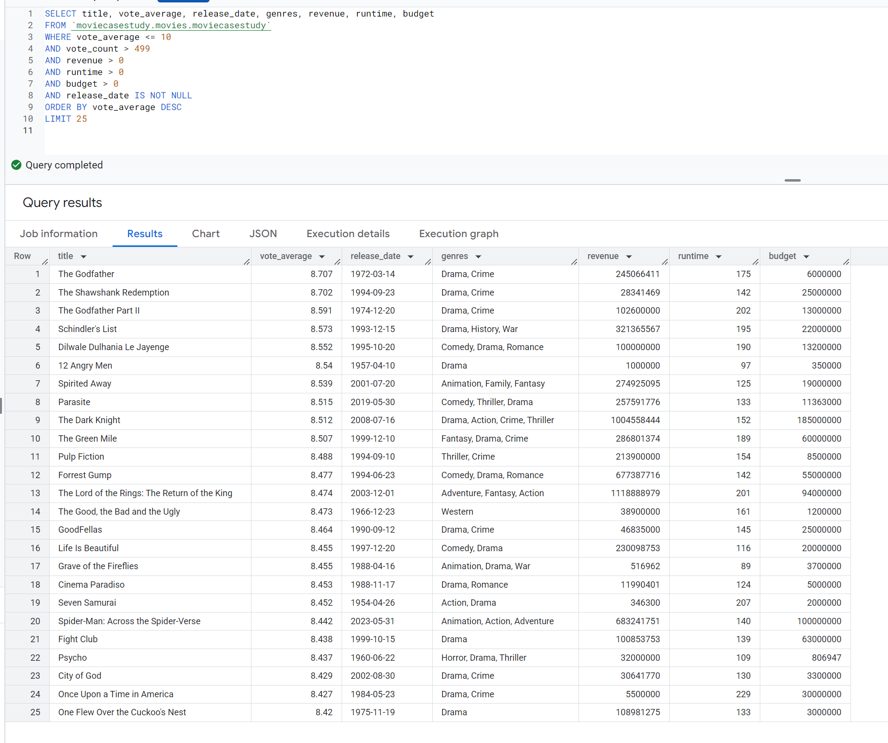

# Movies Case Study
By Jake McKeon

## Introduction
This project is an exploratory data analysis of TMDB movies using the `tmdb_movie_dataset.csv` file. The dataset includes meta data of over 150,000 movies!

## Significance
As streaming competition intensifies, understanding what makes a movie successful is more important than ever. With thousands of films available on platforms like Netflix, analyzing trends in movie performance—such as genre popularity, viewer ratings, production investments, and release timing—can uncover what drives engagement. These insights can help content creators, studios, and streaming services make data-driven decisions about which types of movies to invest in and promote

## Goals
Explore and understand the structure and content of the `tmdb_movie_dataset.csv` file

Analyze key movie attributes such as `average_voter_rating`, `release_date`, `revenue`, `runtime`, `budget`, and `genre`

Identify the most popular genres, high-performing production companies, and trends in budget vs. revenue

Understand how factors like runtime and release timing correlate with audience engagement and success

## Tools and Skills Involved
This project was completed using:

`R` - for data cleaning, analysis, and visualization

`RStudio` - as the IDE for working with R

`SQL` - for querying and exploring the dataset

`BigQuerry` - for querying and exploring large datasets

`Markdown` - for documenting the analysis

`GitHub` - for version control and sharing work

`Tableau` - for data visualization

## Dataset
File: `tmdb_movie_dataset.csv`

Source: [TMDB Movie Dataset](https://www.kaggle.com/datasets/asaniczka/tmdb-movies-dataset-2023-930k-movies)

## Ask
### Here is where we will be defining the problem
The goal of this analysis is to understand the key factors that drive engagement and success for movies

This includes:

- Identifying the most popular movie genres across all platforms

- Analyzing how factors such as release year, budget, runtime, and production companies influence a movie’s performance

- Exploring the relationship between average vote, revenue, and other indicators of popularity and success

- Gaining insights into what characteristics are most commonly found in successful films

**Our goal is to find data that can help us resolve these and turn them into actionable insights**

## Prepare
### Gathering and ensuring the quality of the data
The dataset used for this analysis is `tmdb_movie_dataset.csv`, which contains metadata on a wide range of movies, including both commercial and critical performance indicators. The data was uploaded to BigQuery for exploration and analysis using SQL

For this project, we are focusing on the following key columns:

`id` – Unique identifier for each movie

`title` – Title of the movie

`vote_average` – Average user rating (on a scale from 0 to 10)

`vote_count` - How many people rate each movie

`release_date` – Official release date of the movie

`revenue` – Total worldwide box office revenue

`runtime` – Length of the movie (in minutes)

`budget` – Estimated production budget

`genre` – Primary genres associated with the movie

**We have prepared the data by:**

- Downloading the `tmdb_movie_dataset.csv` file

- The file size was originally too large for BigQuery, with over 1 million movies listed

- Removed many listed movies so I could upload the file to BigQuery, but there are still over 150,000 movies before cleaning

- The official number of movies in the dataset right now is **150,392**. This is before any processing

## Process
### Clean, transform, and prepare the data for analysis
- Ensure there are no missing or null values in key columns like `release_date`, `genre`, and `title`

- Ensure all numerical fields are properly formatted and categorized

- Ensure that the dataset does not contain duplicate entries for the same title or year

- Standardize text fields like `release_date` to ensure consistency

**We start to process the data by:**

- Cleaning the data. We are removing duplicates, null values, outliers, and unrealistic values

We find out that there are over **24,000** movie titles that are duplicates

We then count the amount of `distinct` movie titles and find that there are **134,836**. This includes movie data with null values

This shows that we are counting the number of `distinct` movies in the dataset where each attribute is **not null**

You can see our number of movies has decreased again to **134,644**

We count using the movie `title` instead of the `id` because each row (including duplicates) has its own id

Here we can see

This looks very similar to the previous query. Even though the values are not null, we are making sure that the values fall into the appropriate range and have no unrealistic values like a `vote_average` below 0 or above 10, and `revenue`, `runtime`, and `budget` are not negative values

Luckiily we get the same number of movies at **134,644**

## Analyze
### Examine the data using techniques and tools to identify patterns and insights
Using SQL and R, perform initial data exploration and summary statistics.

- **Identify Popular Genres** 

   Analyze the frequency of each genre in the dataset to determine which types of movies are most commonly produced and potentially most popular. This provides insight into audience preferences and industry trends
  

  
  This shows the top 25 highest rated movies with atleast 500 votes, as there were many with a 10.0 rating while having less than 10 votes. This gives us more accurate information.

  I have gone through many metrics like comparing runtime and budget to genre, release dates and many more. This is dozens of screenshots so I will not include them in this document.

- **Release year distribution**
 
    Visualize how the number of movies released each year has changed over time. This can help highlight shifts in production volume and identify periods of industry growth or decline

- **Budget and Revenue Trends**
  
  Explore how movie budgets and box office revenues vary across genres and over time. This can reveal which genres tend to be high-investment and which generate the highest returns

- **Production Companies Analysis**
  
  Determine which production companies are most active in the industry by analyzing how many movies each company has released and their associated revenue and vote averages

## Share
### Communicate the findings and insights through reports and visuals
- **Most Popular Genres**
  
Visualize the most frequently occurring genres in the dataset and identify which genres dominate the movie landscape. This can help uncover audience preferences and industry trends

- **Impact of Release Year on Engagement**

Show how movie release years correlate with vote averages, revenue, and other success metrics. Analyze how production trends change over time and their potential impact on engagement

- **Production Company Success**

  Analyze the performance of movies by production company, focusing on metrics such as revenue, budget, and vote average. This helps identify leading studios and trends in successful movie production

## Act
### Implement solutions or make decisions based on analysis
- **Key Takeaways**
- **Actionable Recommendations**
- **Content Strategy**

- Content production strategies, focusing on certain genres or targeting specific regions

- **Marketing**

- Propose marketing campaigns based on high-performance content types or partnerships with popular directors/ genres

